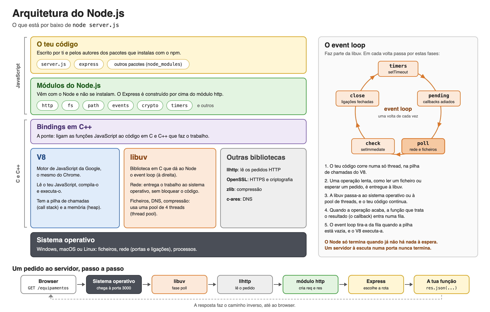

# Primeiro servidor

Módulo Aplicações baseadas em browsers. Segundo tema do módulo, com três aulas de 60 minutos. Este guia explica o que é o Node.js, como se prepara uma pasta para um servidor e como funciona, linha a linha, um servidor com duas rotas. Os passos para o fazeres no teu computador estão no [laboratório](02-primeiro-servidor-laboratorio.md), e os exercícios para fazeres sozinho estão na [ficha](02-primeiro-servidor-exercicios.md).

## Neste guia

1. O que vais aprender
2. O que já sabes e vais usar
3. O Node.js: JavaScript fora do browser
4. O que há dentro do Node
5. Um programa que não acaba: o processo servidor
6. O npm e o ficheiro package.json
7. Módulos ES: o import e o "type": "module"
8. O Express
9. Exemplo guiado: o catálogo de equipamentos
10. O que corre onde, agora com código
11. Erros de arranque e como os ler
12. Este servidor não usa await
13. Erros frequentes
14. Verificar o que aprendeste
15. O que vem a seguir

## O que vais aprender

No primeiro tema desenhaste a conversa entre o browser e o servidor do lado de quem a vê, no browser. Neste tema passas para o outro lado: escreves o programa que fica à espera dos pedidos e lhes responde. É um servidor pequeno, com os equipamentos da escola guardados num array, ainda sem base de dados, e o browser fala com ele exatamente como fala com a Wikipédia: pelo mesmo HTTP, com pedidos e respostas como os que o primeiro tema descreveu.

No fim deste guia deves conseguir:

- explicar o que é o Node.js e o que muda quando o JavaScript corre fora do browser;
- explicar para que servem o npm, o `package.json`, a pasta `node_modules` e o `package-lock.json`;
- escrever um `import` e explicar porque é que o `package.json` precisa de `"type": "module"`;
- ler, linha a linha, um servidor Express com duas rotas `GET`, e dizer o que cada linha faz e quando é executada;
- ligar, parar e reiniciar um servidor, e explicar o que é a porta onde ele escuta;
- perante uma mensagem de erro no terminal, encontrar a linha que interessa, dizer se o problema está no `import`, na instalação ou na porta, e corrigi-lo.

## O que já sabes e vais usar

Do primeiro tema: os três programas (browser, servidor de aplicação e servidor de dados), o pedido e a resposta, a porta, as partes de um endereço, o método `GET`, os códigos de estado e a diferença entre "ligação recusada", em que nenhum programa respondeu, e um 404, em que um servidor respondeu a dizer que não tem o que se pediu. Se alguma destas ideias não estiver firme, relê a secção correspondente do [guia do primeiro tema](01-do-pedido-a-resposta.md) antes de continuares.

De JavaScript, dos anos anteriores:

- `const` para dar nome a um valor que não muda;
- arrays de objetos, como `[{ id: 1, nome: "Portátil" }, { id: 2, nome: "Projetor" }]`;
- funções seta, como `(a, b) => { return a + b; }`, que se podem passar a outra função para ela as chamar mais tarde;
- os textos com crases e `${ }`, como `` `Olá, ${nome}` ``, que metem o valor de uma variável no meio de um texto;
- módulos, com `import` e `export`, que juntam código de vários ficheiros.

Do terminal: abrir um terminal, ver em que pasta estás, mudar de pasta com `cd` e correr um comando.

A preparação completa de um projeto, com scripts, ficheiros de configuração, segredos fora do código e Git, é matéria de Linguagens de Programação. Neste tema fazes só o mínimo para um servidor correr, e o resto aproveita-se de lá quando for preciso.

## O Node.js: JavaScript fora do browser

### A linguagem e o sítio onde corre

Até agora, quase todo o JavaScript que escreveste correu dentro do browser. O browser traz um programa que lê JavaScript e o executa, e dá a esse JavaScript acesso à página: o `document`, para encontrar e mudar elementos, o `window`, os eventos de clique.

O **Node.js** é um programa que executa JavaScript fora do browser, diretamente no sistema operativo do computador. A linguagem é a mesma: as variáveis, as funções, os arrays e os objetos escrevem-se da mesma maneira. O que muda é o que está à volta. No Node não há página, e por isso não há `document` nem `window`. Em troca, há coisas que o browser não deixa fazer, por boas razões de segurança: ler e escrever ficheiros do disco, abrir ligações de rede e, o que interessa neste módulo, ficar à escuta numa porta, à espera de pedidos.

Uma forma de arrumar a ideia: o JavaScript é a língua, e o browser e o Node são dois sítios onde essa língua se fala, cada um com as suas coisas à volta. No browser, o JavaScript serve para mexer na página que o utilizador está a ver. No Node, serve, entre outras coisas, para escrever o servidor que constrói as páginas.

### Primeiro contacto

Um programa em Node é um ficheiro de texto com JavaScript. Este chama-se `ola.js`:

```js
// ola.js: um programa que escreve duas linhas e termina.
const escola = "EPMS";
console.log(`Olá, ${escola}!`);
console.log("Este JavaScript está a correr no Node, e não num browser.");
```

Corre-se no terminal, dentro da pasta onde está o ficheiro, com o comando `node` seguido do nome do ficheiro:

```text
node ola.js
```

E o terminal mostra:

```text
Olá, EPMS!
Este JavaScript está a correr no Node, e não num browser.
```

Repara em duas coisas. A primeira é onde aparece o `console.log`: no terminal, e não na consola das ferramentas de programador do browser, porque não há browser nenhum envolvido. Vai ser assim também no servidor, e é uma fonte de confusão frequente: o que o servidor escreve com `console.log` aparece no terminal onde o servidor está a correr, nunca no browser.

A segunda é que o programa termina. Fez o que tinha a fazer, de cima para baixo, e acabou. O terminal fica outra vez livre para o comando seguinte. Um servidor, como vais ver, não se comporta assim.

Para saber que versão do Node tens instalada, escreve `node --version`. Este guia foi escrito e testado com a versão 24 (o terminal mostra algo como `v24.17.0`). Uma versão 22 também serve para tudo o que aqui está. As versões 20 e anteriores já não recebem correções de segurança e não devem ser usadas.

## O que há dentro do Node

Não precisas de saber como o Node está construído por dentro para escrever um servidor. Mas ter uma ideia das camadas ajuda a perceber de onde vêm as coisas que usas e a ler as mensagens de erro, que às vezes falam delas. A imagem seguinte mostra as camadas e, à direita, o caminho que um pedido faz até chegar ao teu código.



Lida de cima para baixo:

- **O teu código** é JavaScript: o teu `server.js` e os pacotes que instalas, como o Express. Os pacotes também são JavaScript, escrito por outras pessoas, e ficam na pasta `node_modules`.
- **Os módulos do Node** vêm com o Node e não se instalam. O módulo `http` sabe receber pedidos e enviar respostas HTTP; o `fs` sabe ler e escrever ficheiros. O Express é construído por cima do `http`: faz o mesmo trabalho, com menos linhas da tua parte.
- **O V8** é o motor que lê o teu JavaScript e o executa. É o mesmo motor do Chrome; o Node pegou nele e pô-lo a correr fora do browser.
- **A libuv** é uma biblioteca escrita em C que trata do que é lento: a rede e os ficheiros. Quando o teu servidor está à espera de pedidos, não está parado a olhar para a porta: entregou essa espera à libuv, que avisa quando chega um pedido. É por isso que um servidor Node consegue atender muitos pedidos ao mesmo tempo, apesar de o teu código correr numa só linha de execução.
- **O sistema operativo**, por fim, é quem tem as portas, as ligações de rede e os ficheiros.

O lado direito da imagem segue um pedido `GET /equipamentos`: chega à porta onde o servidor escuta, a libuv dá por ele, o módulo `http` lê-o e prepara dois objetos, um com o pedido e outro para a resposta, o Express escolhe a rota certa e, por fim, chama a tua função, que responde. A resposta faz o caminho inverso até ao browser. No exemplo guiado vais escrever essa última caixa, a função da rota, e tudo o resto acontece sem escreveres uma linha.

## Um programa que não acaba: o processo servidor

O `ola.js` corre e termina. Um servidor não pode terminar: tem de ficar ligado, à espera de pedidos que ainda não chegaram. Quando o ligas com `node server.js`, o programa arranca, prepara as rotas, pede ao sistema operativo para escutar numa porta e fica ali. O terminal deixa de aceitar comandos, porque está ocupado com o servidor. Não é um erro: é o servidor a fazer o seu trabalho.

A um programa que está a correr chama-se **processo**. Enquanto o processo do servidor estiver vivo, o servidor responde. Para o parar, carrega em Ctrl+C no terminal onde ele está a correr (também no Mac é Ctrl, e não Cmd). O processo termina, a porta fica livre, e um pedido do browser passa a receber "ligação recusada", como viste no laboratório do primeiro tema.

Três consequências práticas, que vais encontrar logo na primeira aula:

**Uma porta, um processo.** Só um programa de cada vez pode escutar numa porta. Se ligares o servidor num terminal e, esquecido, o voltares a ligar noutro, o segundo não consegue a porta e não arranca. O primeiro continua a correr e a responder.

**O Node lê o ficheiro uma vez, quando arranca.** Se mudares o `server.js` com o servidor ligado, o servidor não dá por isso: continua a correr o código que leu ao arrancar. Para ver a mudança, paras o servidor com Ctrl+C e voltas a ligá-lo. Há uma forma de o Node fazer isto sozinho, `node --watch server.js`, que reinicia o servidor sempre que guardas o ficheiro e escreve `Restarting 'server.js'` no terminal. É cómoda, mas convém primeiro perceber o que ela faz por ti.

**O que está em memória perde-se quando o processo termina.** Os equipamentos do exemplo deste tema estão num array. Se o servidor acrescentasse um equipamento a esse array, ele desapareceria ao parar o servidor. É uma das razões para haver um servidor de dados, que guarda tudo no disco: chega no segundo módulo.

## O npm e o ficheiro package.json

### Pacotes

O Express não vem com o Node. É um **pacote**: código JavaScript escrito por outras pessoas, publicado num repositório público de pacotes, de onde qualquer pessoa o pode descarregar. Há centenas de milhares de pacotes. O programa que os descarrega e organiza chama-se **npm** (Node Package Manager, gestor de pacotes do Node) e é instalado juntamente com o Node.

Convém não confundir os dois comandos. `node` executa um programa JavaScript. `npm` trata dos pacotes de que esse programa precisa. Escreves `npm` para preparar a pasta e `node` para correr o servidor.

### A pasta do servidor e o package.json

Cada servidor vive na sua pasta, e cada pasta tem um ficheiro `package.json`, que descreve o projeto: o nome, a versão, os pacotes de que precisa e algumas regras de funcionamento. Cria-se com:

```text
npm init -y
```

O `-y` responde "sim" a todas as perguntas que o npm faria, e aceita os valores por omissão. O ficheiro criado, numa pasta chamada `catalogo-de-equipamentos`, fica assim:

```json
{
  "name": "catalogo-de-equipamentos",
  "version": "1.0.0",
  "description": "",
  "main": "index.js",
  "scripts": {
    "test": "echo \"Error: no test specified\" && exit 1"
  },
  "keywords": [],
  "author": "",
  "license": "ISC",
  "type": "commonjs"
}
```

O nome vem da pasta. Os campos `main`, `scripts`, `keywords`, `author` e `license` não interessam por agora; os scripts são tratados em Linguagens de Programação. O campo que interessa já é o último, `"type"`, e a secção 7 explica porque é que vais mudá-lo.

### Instalar o Express

```text
npm install express
```

O npm vai buscar o Express ao repositório de pacotes, pela internet, e escreve no fim algo como `added 68 packages`. Sessenta e oito pacotes para instalar um: o Express usa outros pacotes, que usam outros, e o npm traz todos. Depois do comando, a pasta tem três coisas novas:

- **A pasta `node_modules`**, com o código dos 68 pacotes. É aqui que o Node os vai procurar.
- **No `package.json`, uma secção `dependencies`**, com `"express": "^5.2.1"`. Diz que este projeto precisa do Express, na versão 5. O `^` quer dizer "a 5.2.1 ou uma mais recente, desde que continue a ser 5": uma versão 6 poderia mudar coisas de que o código depende, e por isso não é aceite.
- **O ficheiro `package-lock.json`**, com a versão exata de cada um dos 68 pacotes que foram instalados. Serve para que outra pessoa, noutro computador, instale exatamente as mesmas versões.

Da pasta `node_modules`, três regras. Não se mexe lá dentro: é código dos pacotes, não teu. Não se copia nem se envia a ninguém: com o `package.json` e o `package-lock.json`, qualquer pessoa a recria com `npm install`, sem argumentos, que lê os dois ficheiros e instala o que lá está. E, por isso mesmo, não se guarda no Git: é a regra mais comum de um ficheiro `.gitignore`, que vais ver em Linguagens de Programação.

## Módulos ES: o import e o "type": "module"

### O import

Já usaste módulos: um ficheiro que exporta uma função com `export` e outro que a usa com `import`. No servidor, a primeira linha de código é um `import`:

```js
import express from "express";
```

Lê-se assim: vai buscar o que o pacote `express` exporta e dá-lhe o nome `express` neste ficheiro. Quando o texto entre aspas é só um nome, sem `./` à frente, o Node procura um pacote com esse nome na pasta `node_modules`. Quando começa por `./`, como em `import { equipamentos } from "./dados.js"`, procura um ficheiro teu, a partir da pasta onde está o ficheiro que faz o `import`. É por isso que um `import` de um pacote só funciona depois do `npm install`: antes disso, a pasta `node_modules` não existe e o Node não tem onde procurar.

### Dois sistemas de módulos

O Node tem dois sistemas de módulos, por razões históricas. O mais antigo chama-se CommonJS e usa `require`:

```js fragment
const express = require("express");
```

O mais recente, que é também o do browser, chama-se **módulos ES** (de ECMAScript, o nome oficial do JavaScript) e usa `import` e `export`. Neste módulo usa-se sempre `import`. Vais encontrar muitos exemplos na internet escritos com `require`: fazem o mesmo, mas não se misturam os dois sistemas no mesmo ficheiro, e um exemplo com `require` não se copia para um ficheiro com `import` sem o converter.

O Node precisa de saber qual dos dois sistemas um ficheiro usa, e é isso que diz o campo `"type"` do `package.json`. Com `"type": "commonjs"`, que é o que o `npm init -y` escreve, o Node lê o ficheiro como CommonJS e não aceita o `import`:

```text
SyntaxError: Cannot use import statement outside a module
```

Por isso, depois do `npm init -y`, troca-se uma palavra no `package.json`:

```json
{
  "type": "module"
}
```

(No ficheiro, não se apaga o resto: muda-se só `"commonjs"` para `"module"` na linha do `"type"`.)

Se o campo `"type"` não existir de todo, o Node 24 tenta adivinhar: vê o `import`, corre o ficheiro como módulo ES e escreve um aviso a pedir que acrescentes `"type": "module"`. Funciona, mas o aviso aparece em cada arranque, e outras versões do Node não adivinham. A regra deste módulo é simples: o `package.json` de um servidor tem sempre `"type": "module"`.

## O Express

O módulo `http` do Node chegava para escrever um servidor. Mas obriga a fazer à mão muita coisa repetitiva: olhar para o caminho e para o método de cada pedido e decidir, com uma série de `if`, que código corre; escrever os cabeçalhos da resposta; converter os dados para JSON. O **Express** é um pacote que faz esse trabalho e deixa-te escrever só o que é teu: que caminhos o servidor conhece e o que responde a cada um. É o pacote mais usado para isto em Node, e é o deste módulo, na versão 5.

Um servidor Express tem quatro peças, e vais vê-las todas no exemplo guiado:

- **`express()`** cria a aplicação, um objeto a que por costume se chama `app`. É ela que guarda as rotas.
- **`app.get(caminho, função)`** regista uma rota: "quando chegar um pedido `GET` a este caminho, chama esta função". A função é tua e chama-se o **handler** (em português, quem trata) da rota.
- **A função da rota** recebe dois objetos, `req` e `res`. O `req` (de request, pedido) tem tudo o que veio no pedido: o caminho, os parâmetros, os cabeçalhos. O `res` (de response, resposta) tem as ferramentas para construir a resposta. As mais usadas são `res.send`, que responde com um texto, e `res.json`, que responde com dados em JSON.
- **`app.listen(porta, função)`** liga o servidor: pede ao sistema operativo para escutar na porta e, quando conseguir, ou quando falhar, chama a função.

E uma coisa que o Express faz sem lhe pedires: se chegar um pedido para um caminho e um método que nenhuma rota trata, responde `404` com uma pequena página que diz, por exemplo, `Cannot GET /nao-existe`. Não tens de escrever nada para isso acontecer.

## Exemplo guiado: o catálogo de equipamentos

### O problema

A aplicação de reservas do primeiro tema começa por um catálogo: a lista dos equipamentos que se podem reservar. Antes de haver base de dados, os equipamentos ficam num array, dentro do próprio servidor. O servidor tem duas rotas:

- `GET /` responde com um texto curto, só para se ver que o servidor está vivo;
- `GET /equipamentos` responde com a lista dos equipamentos, em JSON.

O resultado esperado, escrito antes de testar: abrir `http://localhost:3000/` mostra o texto; abrir `http://localhost:3000/equipamentos` mostra os quatro equipamentos; abrir qualquer outro caminho dá 404.

### Passo 1: a pasta e o package.json

Uma pasta nova, chamada `catalogo-de-equipamentos`, e lá dentro:

```text
npm init -y
npm install express
```

No `package.json`, troca-se `"commonjs"` por `"module"`. A pasta fica com o `package.json`, o `package-lock.json` e a pasta `node_modules`. Falta o ficheiro do servidor.

### Passo 2: o ficheiro server.js

Na mesma pasta, o ficheiro `server.js`:

```js
// server.js: o primeiro servidor do catálogo de equipamentos da escola.
// Fica à escuta na porta 3000 e responde a dois pedidos GET.
import express from "express";

const app = express();
const PORTA = 3000;

// Os equipamentos ficam num array, em memória: existem enquanto o servidor
// estiver ligado. Mais à frente passam para uma base de dados.
const equipamentos = [
  { id: 1, nome: "Portátil", sala: "B12" },
  { id: 2, nome: "Projetor", sala: "A03" },
  { id: 3, nome: "Impressora", sala: "Secretaria" },
  { id: 4, nome: "Monitor", sala: "B12" },
];

// Rota 1: um pedido GET a / recebe um texto.
app.get("/", (req, res) => {
  res.send("Olá! O servidor está a funcionar.");
});

// Rota 2: um pedido GET a /equipamentos recebe a lista em JSON.
app.get("/equipamentos", (req, res) => {
  res.json(equipamentos);
});

// Liga o servidor: a partir daqui fica à escuta na porta 3000.
// Se não conseguir (por exemplo, porque a porta já está ocupada),
// o Express chama esta função com o erro.
app.listen(PORTA, (erro) => {
  if (erro) {
    console.error(`Não foi possível ligar o servidor: ${erro.message}`);
    return;
  }
  console.log(`Servidor a correr em http://localhost:${PORTA}`);
});
```

O mesmo código, com o `package.json` e o `package-lock.json`, está na pasta de exemplos do repositório: [catalogo-de-equipamentos](../exemplos/aplicacoes-em-browser/catalogo-de-equipamentos/README.md).

### Passo 3: o código, linha a linha

`import express from "express";` vai buscar o Express à pasta `node_modules`. Sem o `npm install`, ou sem `"type": "module"`, é nesta linha que o servidor falha.

`const app = express();` cria a aplicação. A partir daqui, tudo o que diz respeito ao servidor passa por `app`.

`const PORTA = 3000;` guarda o número da porta numa constante com nome. O número aparece duas vezes mais abaixo, no `listen` e na mensagem; com a constante, mudar de porta é mudar uma linha.

`const equipamentos = [ ... ];` são os dados: um array de quatro objetos, cada um com o `id`, o `nome` e a `sala`. São os mesmos equipamentos da tabela do primeiro tema. Aqui não há tabela nem SQL: o array vive na memória do processo do servidor.

`app.get("/", (req, res) => { ... });` regista a primeira rota. Repara bem no que esta linha faz e no que não faz. Não responde a nada: guarda uma regra para mais tarde. Diz ao Express "quando chegar um `GET /`, chama esta função". A função só corre quando o pedido chegar, e corre uma vez por cada pedido. Se ninguém pedir `/`, nunca corre.

`res.send("Olá! O servidor está a funcionar.");`, dentro da função, é a resposta. O Express acrescenta o código `200`, o cabeçalho `Content-Type: text/html` (para um texto, o Express parte do princípio de que é HTML) e envia o texto como corpo.

`app.get("/equipamentos", (req, res) => { ... });` regista a segunda rota, para outro caminho.

`res.json(equipamentos);` responde com o array. O `res.json` converte o array para texto em JSON e põe o cabeçalho `Content-Type: application/json`, que diz ao browser que o corpo são dados e não uma página. Responde-se em JSON porque, por agora, o que interessa é ver os dados a sair do servidor. No tema 4, a mesma rota passa a construir uma página HTML a partir deste array, com uma linha por equipamento.

Nas duas funções, o parâmetro `req` não é usado. Está lá porque o Express passa sempre os dois objetos pela mesma ordem, primeiro o pedido e depois a resposta, e a função só chega ao segundo se declarar o primeiro. No próximo tema vais usá-lo, para ler o que vem no endereço.

`app.listen(PORTA, (erro) => { ... });` liga o servidor. Pede ao sistema operativo a porta 3000 e, quando tiver uma resposta, chama a função. Se correu bem, `erro` não tem nada e a função escreve no terminal o endereço do servidor. Se correu mal, por exemplo porque outro programa já está a usar a porta, `erro` traz a descrição do problema e a função escreve-a.

O `if (erro)` faz falta. Na versão 5 do Express, esta função é chamada nos dois casos, quando correu bem e quando correu mal. Sem o `if`, com a porta ocupada, o terminal mostrava "Servidor a correr em http://localhost:3000", que seria mentira, e o processo terminava logo a seguir, sem servidor nenhum. Uma mensagem que mente é pior do que nenhuma: mandava-te procurar o erro no sítio errado.

### Passo 4: a ordem em que as coisas acontecem

Quando escreves `node server.js`, o Node corre o ficheiro de cima para baixo, uma vez: faz o `import`, cria a aplicação, cria o array, regista as duas rotas (sem as executar), pede a porta e escreve a mensagem. A partir daí, o ficheiro já foi todo lido, mas o processo não termina, porque está à escuta.

Cada vez que chega um pedido, o Express olha para o método e para o caminho, procura entre as rotas registadas e chama a função da que corresponder. Depois de responder, volta a esperar.

Há, portanto, dois momentos diferentes no mesmo ficheiro. O momento do arranque, que acontece uma vez, e o momento de cada pedido, que acontece tantas vezes quantas os pedidos. Saber em qual dos dois uma linha corre é o que te permite perceber muitos erros: um erro numa linha do arranque impede o servidor de ligar; um erro dentro da função de uma rota só aparece quando alguém pede essa rota.

### Passo 5: ligar e observar no terminal

Na pasta do projeto:

```text
node server.js
```

O terminal mostra:

```text
Servidor a correr em http://localhost:3000
```

E fica ocupado. O servidor está à escuta.

### Passo 6: observar no browser

Com o servidor ligado e as ferramentas de programador abertas no separador Rede, como no laboratório do primeiro tema:

| Endereço | O que o browser mostra | Código | Tipo de conteúdo |
| --- | --- | --- | --- |
| `http://localhost:3000/` | Olá! O servidor está a funcionar. | 200 | `text/html` |
| `http://localhost:3000/equipamentos` | Os quatro equipamentos, em JSON | 200 | `application/json` |
| `http://localhost:3000/nao-existe` | Cannot GET /nao-existe | 404 | `text/html` |

O JSON aparece no browser como texto. O Chrome e o Firefox costumam mostrá-lo arrumado, às vezes com uma opção para ver o texto em bruto; o conteúdo é o mesmo:

```json
[
  { "id": 1, "nome": "Portátil", "sala": "B12" },
  { "id": 2, "nome": "Projetor", "sala": "A03" },
  { "id": 3, "nome": "Impressora", "sala": "Secretaria" },
  { "id": 4, "nome": "Monitor", "sala": "B12" }
]
```

A terceira linha da tabela confirma o que a secção do Express disse: não há nenhuma rota para `/nao-existe`, e o Express respondeu sozinho com 404.

### Passo 7: parar e voltar a ligar

No terminal, Ctrl+C. O terminal volta a aceitar comandos. No browser, recarrega `http://localhost:3000/`: agora a resposta é "ligação recusada", sem código de estado, como na parte 6 do laboratório do primeiro tema. O servidor não está a correr.

Liga-o outra vez com `node server.js` e recarrega: volta a responder. Se entretanto tivesses mudado o texto da primeira rota, era agora que a mudança aparecia.

## O que corre onde, agora com código

O desenho do primeiro tema continua a valer, agora com as linhas do teu ficheiro lá dentro.

| O quê | Onde corre ou onde fica |
| --- | --- |
| O ficheiro `server.js`, todo ele | No processo do Node, no computador do servidor. O browser nunca o recebe nem o vê |
| O array `equipamentos` | Na memória desse processo. Perde-se quando o servidor para |
| Uma mensagem escrita com `console.log` | No terminal onde o servidor está a correr |
| O texto de `res.send` e os dados de `res.json` | Vão no corpo da resposta e são mostrados pelo browser |
| O pedido a `/equipamentos` | Feito pelo browser, quando escreves o endereço |

Um teste rápido: se acrescentares `console.log("Alguém pediu a lista");` dentro da função da rota `/equipamentos`, onde aparece a frase, e quantas vezes? Aparece no terminal do servidor, uma vez por cada pedido à lista. Não aparece no browser, nem quando o servidor arranca.

## Erros de arranque e como os ler

### Como ler uma mensagem de erro do Node

As mensagens de erro do Node parecem assustadoras, porque têm muitas linhas. Quase todas são o caminho que o erro fez por dentro do Node, e para ti contam poucas. Lê-se assim:

1. Procura a linha que começa pelo tipo do erro: `SyntaxError`, `TypeError`, `Error`, às vezes com um código entre parênteses retos, como `Error [ERR_MODULE_NOT_FOUND]`. Essa linha diz o que aconteceu.
2. Procura, acima dela, o nome do teu ficheiro com o número da linha, como `server.js:18`. Diz onde aconteceu. Muitas vezes o Node mostra a própria linha e põe acentos circunflexos (`^`) por baixo da parte onde falhou.
3. As linhas que começam por `at` são o percurso por dentro do Node. Podes ignorá-las quase sempre.

As mensagens de erro do Node estão em inglês, e não há forma de as mudar. As que se seguem são as que vais encontrar mais vezes num primeiro servidor, tal como aparecem no Node 24. Antes de ires para a solução, tenta dizer se o erro é do arranque ou de um pedido.

### O import num ficheiro que não é módulo

```text
SyntaxError: Cannot use import statement outside a module
```

Aparece no arranque, apontado à linha do `import`, normalmente depois de um aviso a dizer `Make sure to set "type": "module"`. O `package.json` tem `"type": "commonjs"`, que é o que o `npm init -y` escreve, e por isso o Node lê o ficheiro como CommonJS. Corrige-se pondo `"type": "module"` no `package.json` da pasta do servidor. Se o campo `"type"` faltar de todo, este erro não aparece: como explica a secção 7, o Node 24 corre o ficheiro como módulo ES e escreve só um aviso.

### O pacote que não se encontra

```text
Error [ERR_MODULE_NOT_FOUND]: Cannot find package 'express' imported from .../server.js
```

No arranque. O Node procurou o Express em `node_modules` e não o encontrou. Há três causas comuns: não correste `npm install express` nesta pasta; correste-o noutra pasta; ou escreveste mal o nome no `import`. Se a mensagem disser `Cannot find package 'expres'`, com o nome mal escrito entre aspas, o erro está no `import`; se disser `'express'`, bem escrito, o problema é a instalação. Confirma com `ls` (ou `dir`, no Windows) que a pasta `node_modules` existe ao lado do `server.js`.

### O ficheiro que não se encontra

```text
Error: Cannot find module '.../server.js'
```

No arranque, antes de qualquer linha do teu código. O Node procurou o `server.js` na pasta onde estás no terminal, e ele não está lá. Estás noutra pasta. Confirma em que pasta estás com `pwd` (no Mac, no Linux e na PowerShell do Windows) ou com `cd` sem mais nada (na linha de comandos clássica do Windows), e muda para a pasta do projeto com `cd`.

### A porta ocupada

```text
Não foi possível ligar o servidor: listen EADDRINUSE: address already in use :::3000
```

No arranque, e é a mensagem do teu próprio `listen`, graças ao `if (erro)`. `EADDRINUSE` quer dizer que o endereço já está em uso: outro processo está a escutar na porta 3000. Quase sempre é o teu servidor, ligado noutro terminal, ou num terminal do editor que já não estás a ver. Corrige-se parando esse processo com Ctrl+C no terminal dele. Se não o encontrares, muda a constante `PORTA` para outro número, como 3001, e lembra-te de mudar também o endereço no browser.

### Um nome mal escrito no arranque

```text
TypeError: app.gett is not a function
```

No arranque, com o número da linha. Escreveste `app.gett` em vez de `app.get`. "Is not a function" quer dizer que tentaste chamar uma coisa que não é uma função: `app.gett` não existe, por isso não se pode chamar.

### Um erro que só aparece quando chega um pedido

Se o nome mal escrito estiver dentro da função de uma rota, por exemplo `res.sendd` em vez de `res.send`, o servidor arranca sem problemas e escreve a mensagem do `listen`. O erro só acontece quando alguém pede essa rota: nesse momento, o terminal mostra `TypeError: res.sendd is not a function` e o browser recebe uma resposta `500`, com uma página que mostra o mesmo erro. O servidor continua a correr e as outras rotas continuam a responder.

É o exemplo mais claro dos dois momentos do Passo 4. E é também uma razão de segurança para, mais à frente no módulo, não deixar o servidor mostrar estes pormenores ao browser: dizem a quem está do lado de fora como o servidor está feito por dentro.

### Mudei o código e não aconteceu nada

Não é um erro do Node: o servidor está a correr o código que leu quando arrancou. Para-o com Ctrl+C e volta a ligá-lo, ou usa `node --watch server.js`.

### O programa termina logo, sem mensagem nenhuma

O terminal volta a ficar livre e não aparece "Servidor a correr". Falta o `app.listen`, ou ele está escrito de forma que nunca é chamado. Sem `listen`, o ficheiro corre de cima para baixo e termina, como o `ola.js`.

### No browser, "ligação recusada"

Já a conheces do primeiro tema. O servidor não está a correr, ou a porta do endereço não é a do servidor, ou escreveste `https` em vez de `http`. Vê primeiro o terminal: está lá a mensagem "Servidor a correr", e o terminal está ocupado?

## Este servidor não usa await

Talvez já tenhas visto servidores com `async` e `await` nas funções das rotas. Servem para esperar por uma operação demorada, como uma consulta à base de dados, sem bloquear o servidor enquanto ela não acaba. Neste servidor, nenhuma rota espera por nada: os dados estão num array na memória e a resposta é imediata. Por isso não há `await`. Ele vai aparecer quando as rotas passarem a perguntar ao PostgreSQL, no segundo módulo, e é aí que se explica.

## Erros frequentes

### Procurar o console.log no browser

O `console.log` do servidor escreve no terminal do servidor. A consola das ferramentas de programador do browser só mostra o que o JavaScript do browser escreve. São dois programas, em dois sítios.

### Confundir node e npm

`npm init` e `npm install` preparam a pasta; `node server.js` corre o servidor. Escrever `npm server.js` ou `node install express` dá erro.

### Instalar o Express noutra pasta

O `npm install` instala na pasta onde estás no terminal. Se o correres numa pasta e o `server.js` estiver noutra, o `import` não encontra o pacote. Faz sempre `cd` para a pasta do projeto antes de qualquer comando.

### Ligar o servidor duas vezes

Um terminal esquecido com o servidor ligado faz o segundo arranque falhar com `EADDRINUSE`. Antes de abrires outro terminal, vê se o primeiro ainda está ocupado.

### Esperar que o browser corra o server.js

Abrir o `server.js` no browser, com duplo clique, mostra o ficheiro como texto, ou nem isso. O browser não corre o servidor: fala com ele, através de um endereço `http://localhost:3000/`, depois de o servidor estar ligado no terminal.

### Copiar um exemplo com require para um ficheiro com import

Os dois sistemas de módulos não se misturam. Se copiares um exemplo com `require`, converte-o para `import` antes de o usares.

## Verificar o que aprendeste

1. Que diferenças há entre correr JavaScript no browser e no Node? Dá um exemplo de uma coisa que só existe num dos dois.
2. Porque é que o `ola.js` termina e o `server.js` não?
3. Para que serve cada um destes: `package.json`, `node_modules`, `package-lock.json`? Qual deles não se envia a ninguém, e porquê?
4. O que quer dizer `"express": "^5.2.1"`?
5. Porque é que se muda `"type"` para `"module"` depois do `npm init -y`? Que erro aparece se não se mudar?
6. Na linha `app.get("/equipamentos", (req, res) => { res.json(equipamentos); });`, quando é que a função corre? Quantas vezes?
7. Que diferença há, na resposta, entre `res.send("...")` e `res.json(...)`?
8. Para que serve o `if (erro)` dentro do `app.listen`?
9. O servidor arranca bem, mas um pedido a uma das rotas devolve 500. O erro está no arranque ou dentro da função dessa rota? Onde vais ler a mensagem?
10. Mudaste o texto da rota `/` e o browser continua a mostrar o antigo. O que se passa?

## O que vem a seguir

No tema 3, HTTP, rotas e middleware, o servidor passa a usar o `req`. Vais escrever rotas que leem partes do endereço, como o número do equipamento em `/equipamentos/2` e o filtro em `/equipamentos?sala=B12`, e que escolhem o código de estado da resposta, como um 404 quando o equipamento pedido não existe. Vais também observar estes pedidos no browser, como no primeiro tema, e conhecer o middleware, que é código que corre antes das rotas.

Antes disso, faz o [laboratório](02-primeiro-servidor-laboratorio.md), em que constróis este servidor do zero e provocas, de propósito, os erros da secção 11, e a [ficha](02-primeiro-servidor-exercicios.md), com o servidor da biblioteca.


